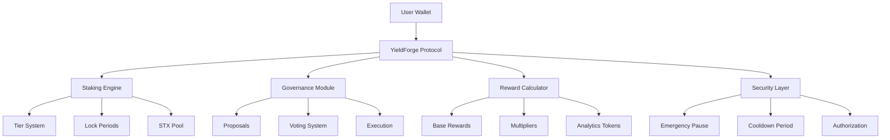

# YieldForge Protocol

**Intelligent Yield Optimization & Governance Hub**

[](https://stacks.co/)
[](https://clarity-lang.org/)
[](LICENSE)

## Overview

YieldForge transforms traditional staking into an intelligent yield optimization engine with progressive reward tiers, democratic governance mechanisms, and institutional-grade risk management. Users unlock enhanced earning potential through strategic time commitments while participating in protocol evolution.

The protocol combines adaptive staking mechanics with community-driven governance, featuring sophisticated tier-based reward optimization and time-locked staking strategies that allow participants to maximize capital efficiency while maintaining full control over protocol direction.

## Key Features

### 🚀 **Intelligent Staking System**

- **Progressive Tier Structure**: Bronze, Silver, and Gold tiers with increasing rewards
- **Time-Lock Multipliers**: Enhanced yields for longer commitment periods
- **Flexible Lock Periods**: 0, 1-month, or 2-month lock options
- **Automatic Tier Upgrades**: Dynamic tier progression based on stake amount

### 🏛️ **Democratic Governance**

- **Weighted Voting System**: Voting power proportional to staked amount
- **Proposal Creation**: Community-driven protocol improvements
- **Transparent Execution**: On-chain governance with clear voting periods
- **Minimum Participation**: Ensures meaningful community engagement

### 🛡️ **Enterprise Security**

- **Emergency Pause Mechanism**: Protocol-wide safety controls
- **Mandatory Cooldown Periods**: 24-hour security delay for unstaking
- **Health Factor Monitoring**: Risk management for user positions
- **Owner Controls**: Administrative functions with proper authorization

### 📊 **Analytics & Rewards**

- **Real-time Reward Calculation**: Dynamic yield computation
- **Analytics Token Integration**: Native protocol token economics
- **Performance Tracking**: Comprehensive position monitoring
- **Accumulated Rewards**: Compound interest mechanics

## System Architecture



## Contract Architecture

### Core Components

#### 1. **Data Structures**

- **UserPositions**: Comprehensive user portfolio and tier status
- **StakingPositions**: Active stakes with time locks and rewards
- **Proposals**: Governance proposal tracking and voting results
- **TierLevels**: Configuration for tier benefits and requirements

#### 2. **State Management**

- **Protocol State**: Global variables for contract operation
- **Emergency Controls**: Pause and resume functionality
- **Pool Management**: Total STX locked tracking
- **Governance Tracking**: Proposal counting and management

#### 3. **Function Categories**

##### **Public Functions**

- `initialize-contract`: Protocol setup and tier configuration
- `stake-stx`: Stake STX with optional time commitment
- `initiate-unstake` / `complete-unstake`: Two-phase withdrawal process
- `create-proposal`: Submit governance proposals
- `vote-on-proposal`: Cast weighted votes
- `pause-contract` / `resume-contract`: Emergency controls

##### **Read-Only Functions**

- `get-contract-owner`: Retrieve owner address
- `get-stx-pool`: Total locked STX amount
- `get-proposal-count`: Governance activity tracking

##### **Private Functions**

- Tier calculation utilities
- Reward computation algorithms
- Input validation functions

## Tier System

| Tier | Minimum Stake | Reward Multiplier | Features |
|------|---------------|-------------------|----------|
| **Bronze** | 1M uSTX | 1.0x | Basic staking |
| **Silver** | 5M uSTX | 1.5x | Enhanced features |
| **Gold** | 10M uSTX | 2.0x | Premium benefits |

### Lock Period Bonuses

| Lock Period | Bonus Multiplier | Duration |
|-------------|------------------|----------|
| No Lock | 1.0x | Immediate withdrawal |
| 1 Month | 1.25x | 30 days (4,320 blocks) |
| 2 Months | 1.5x | 60 days (8,640 blocks) |

## Data Flow

### Staking Process

```
1. User calls stake-stx(amount, lock-period)
2. Validate parameters and contract state
3. Transfer STX to protocol vault
4. Calculate tier level and multipliers
5. Update user position and staking records
6. Register position with reward tracking
```

### Governance Flow

```
1. Eligible user creates proposal
2. Community voting period begins
3. Users cast weighted votes
4. Voting period expires
5. Proposal execution (if successful)
```

### Reward Calculation

```
Formula: (stake × base_rate × tier_multiplier × lock_multiplier × blocks) / normalization_factor

Where:
- stake: Amount staked in uSTX
- base_rate: 5% annual (500 basis points)
- tier_multiplier: 100-200 (1x-2x)
- lock_multiplier: 100-150 (1x-1.5x)
- blocks: Time elapsed since last claim
- normalization_factor: 14,400,000 (block adjustment)
```

## Getting Started

### Prerequisites

- [Clarinet](https://github.com/hirosystems/clarinet) for development
- [Stacks Wallet](https://wallet.hiro.so/) for interaction
- STX tokens for staking

### Installation

1. **Clone the repository**

   ```bash
   git clone https://github.com/your-org/yield-forge.git
   cd yield-forge
   ```

2. **Install dependencies**

   ```bash
   npm install
   ```

3. **Check contract syntax**

   ```bash
   clarinet check
   ```

4. **Run tests**

   ```bash
   npm test
   ```

### Deployment

1. **Configure networks** in `settings/` directory
2. **Deploy to testnet**

   ```bash
   clarinet deploy --testnet
   ```

### Usage Examples

#### Stake STX with 1-month lock

```clarity
(contract-call? .yield-forge stake-stx u5000000 u4320)
```

#### Create governance proposal

```clarity
(contract-call? .yield-forge create-proposal 
  u"Increase base reward rate to 6%" 
  u1440)
```

#### Vote on proposal

```clarity
(contract-call? .yield-forge vote-on-proposal u1 true)
```

## Security Considerations

### Built-in Protections

- **Two-phase withdrawal**: Prevents flash loan attacks
- **Cooldown periods**: 24-hour security delay
- **Input validation**: Comprehensive parameter checking
- **Emergency controls**: Protocol pause capability
- **Access controls**: Owner-only administrative functions

### Best Practices

- Always verify contract addresses before interaction
- Understand lock periods before staking
- Participate in governance responsibly
- Monitor tier progression for optimization

## API Reference

### Core Functions

#### `stake-stx(amount: uint, lock-period: uint) -> (response bool uint)`

Stakes STX tokens with optional time commitment.

**Parameters:**

- `amount`: STX amount to stake (minimum 1M uSTX)
- `lock-period`: Lock duration (0, 4320, or 8640 blocks)

**Returns:** Success boolean or error code

#### `create-proposal(description: string-utf8 256, voting-period: uint) -> (response uint uint)`

Creates a new governance proposal.

**Parameters:**

- `description`: Proposal description (10-256 characters)
- `voting-period`: Voting duration (100-2880 blocks)

**Returns:** Proposal ID or error code

### Error Codes

- `u1000`: ERR-NOT-AUTHORIZED
- `u1001`: ERR-INVALID-PROTOCOL
- `u1002`: ERR-INVALID-AMOUNT
- `u1003`: ERR-INSUFFICIENT-STX
- `u1004`: ERR-COOLDOWN-ACTIVE
- `u1005`: ERR-NO-STAKE
- `u1006`: ERR-BELOW-MINIMUM
- `u1007`: ERR-PAUSED

## Testing

The protocol includes comprehensive test coverage:

```bash
# Run all tests
npm test

# Check contract
clarinet check

# Console testing
clarinet console
```

## Contributing

1. Fork the repository
2. Create a feature branch
3. Add tests for new functionality
4. Ensure all tests pass
5. Submit a pull request

## Roadmap

- [ ] **Phase 1**: Core staking and governance (Current)
- [ ] **Phase 2**: Advanced analytics and yield farming
- [ ] **Phase 3**: Cross-chain integration
- [ ] **Phase 4**: Institutional features and APIs

## License

This project is licensed under the MIT License - see the [LICENSE](LICENSE) file for details.
